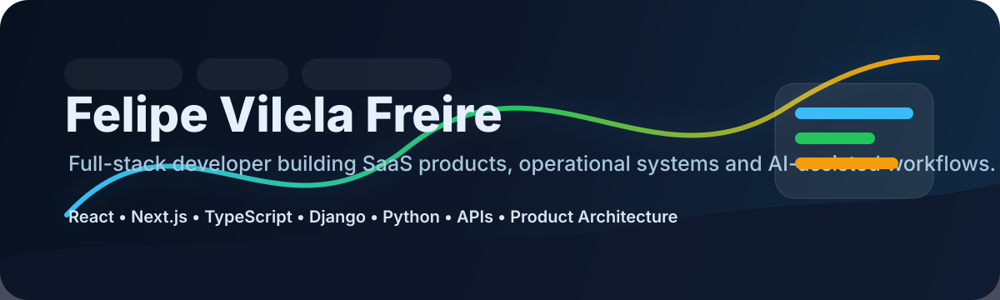
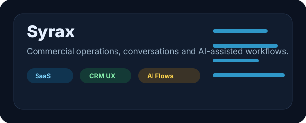
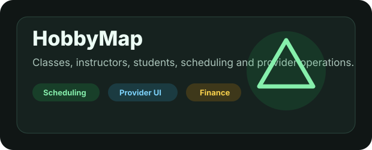
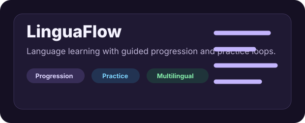
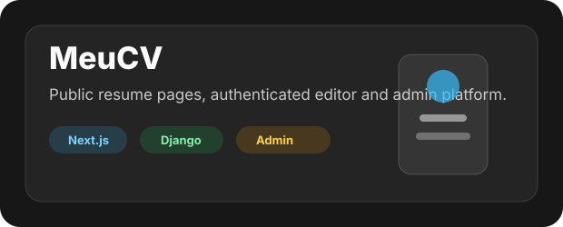

<p align="center">
  
</p>

<p align="center">
  <a href="https://github.com/FelipeVilelaFreire">
    
  </a>
  <a href="mailto:felipe.vilela.freire@gmail.com">
    
  </a>
</p>

## Building Real Products

I am a full-stack developer focused on turning real business workflows into software: SaaS platforms, admin dashboards, API-backed screens, operational automations and AI-assisted user experiences.

My work is not only about making interfaces look good. I care about whether the product actually works end to end: the data model, backend contracts, user permissions, loading states, mobile/web parity, edge cases and the small UX details that make a system feel reliable.

```txt
Product thinking + frontend craft + backend behavior + real workflows
```

## Core Stack

<table>
  <tr>
    <td><strong>Frontend</strong></td>
    <td>React, Next.js, TypeScript, Tailwind CSS, CSS Modules, Framer Motion</td>
  </tr>
  <tr>
    <td><strong>Mobile</strong></td>
    <td>React Native, Expo, shared product logic, web/mobile parity</td>
  </tr>
  <tr>
    <td><strong>Backend</strong></td>
    <td>Python, Django, Django REST Framework, FastAPI, Node.js, REST APIs</td>
  </tr>
  <tr>
    <td><strong>Data</strong></td>
    <td>PostgreSQL, SQLite, schema design, API contracts, operational data</td>
  </tr>
  <tr>
    <td><strong>Product</strong></td>
    <td>SaaS workflows, dashboards, admin panels, onboarding, integrations, automation</td>
  </tr>
  <tr>
    <td><strong>AI</strong></td>
    <td>AI-assisted UX, reply suggestions, knowledge flows, operational copilots</td>
  </tr>
</table>

## Featured Projects

<a href="https://github.com/FelipeVilelaFreire/Syrax">
  
</a>

**Syrax** is a SaaS-style platform for commercial operations, conversations, integrations and AI-assisted workflows.

- CRM-style flows for leads, conversations and operational follow-up.
- Admin and client-facing areas with real backend behavior.
- WhatsApp/conversation UX, integrations, notifications and AI support flows.
- Shared product thinking across web and mobile surfaces.

<br />

<a href="https://github.com/FelipeVilelaFreire/HobbyMap">
  
</a>

**HobbyMap** is a product for managing classes, instructors, students, schedules, provider operations and finance-related flows.

- Provider mode, operational agenda and private activity management.
- Class, instructor and student workflows with practical product states.
- Finance surfaces, recurring classes and role-aware operational screens.
- Cross-surface architecture for web and mobile.

<br />

<a href="https://github.com/FelipeVilelaFreire/LinguaFlow">
  
</a>

**LinguaFlow** is a language-learning product with guided progression, practice flows and multilingual learning structure.

- Progression contracts for language-learning phases.
- Practice experiences and QA surfaces for learning content.
- German, Spanish and multilingual flow organization.
- Product structure focused on consistency, repetition and usable learning loops.

<br />

<a href="https://github.com/FelipeVilelaFreire/meucv.com">
  
</a>

**MeuCV** is a CV platform with a public resume page, authenticated editor, Django API and separate React admin panel.

- Public CV pages by username.
- Authenticated resume editor with profile, projects, skills and media.
- Django REST API with profile photo upload and nested CV content.
- Separate React admin panel for user management and platform overview.

## How I Build

| Principle | What it means in practice |
|---|---|
| Backend truth first | Screens should represent real API behavior, permissions and persisted data. |
| Product before decoration | UI matters, but it should serve the workflow instead of hiding missing logic. |
| Operational clarity | Admin tools should be editable, readable and safe for repeated use. |
| Shared rules | When web and mobile represent the same product flow, the rules should stay aligned. |
| Useful documentation | Docs should map real code paths, decisions and product boundaries. |

## Current Focus

- Building SaaS products with real operational depth.
- Improving backend architecture with Django and API-first contracts.
- Creating polished frontend systems that still respect backend reality.
- Designing admin dashboards and business workflows that are actually usable.
- Exploring AI-assisted product experiences without overpromising autonomy.

## GitHub Snapshot

<p align="center">
  
  
</p>

<p align="center">
  <strong>Building practical software, one real workflow at a time.</strong>
</p>
